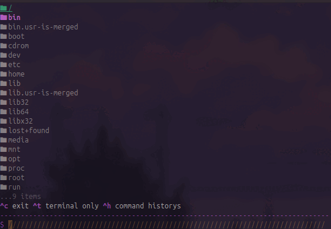

# LURU



File Explorer and terminal at same time. A terminal tool to help finding a your folder directories, and run some commands at the directorys.

# Instalations

> [!NOTE]
> This project is my first project that write in rust.
> this project is not support for``windows``.   

**Quick Install**
```sh
culr -LsSf https://raw.githubusercontent.com/ReazonGd/luru/refs/heads/main/release/install.sh | sh
```

**Build and Install**
To install luru,make sure you have cargo. and then,
```sh
git clone https://github.com/ReazonGd/luru.git luru
cd ./luru
make build
make install
```

 
